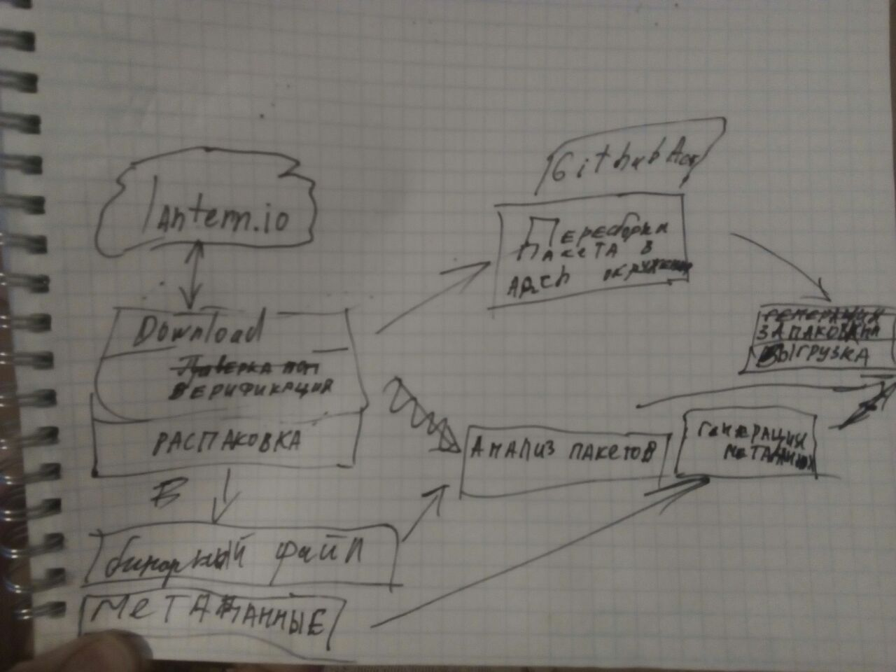

# lantern-distro-port

## Проблема:
Требовалось перепаковать debian или бинарный файл (без исходников) для других дистрибутивов в автоматическом режиме. В качестве входных данных был дан пакет Lantern Desktop.
## Действия:
Мы выбрали для выполнения скриптов окружение GitHubActions. И написали три стадии: с получением и распоковкой deb дистрибутива, с проверкой валидности и генерации метаданных, со скачкой или устанокой дополнительных библиотек, со сборкой и запаковкой для других дистрибутивов.

## Прогресс:
Вчера проект разделился на три скрипта: скачка и верификация, анализ и генерация, и сборка. Вчера возникли проблемы со сборкой и подключением библиотек в других версиях. Сегодня весь день исправляли эти трудности. 

## Сейчас:
Достигнута цель сборки из Deb в Aur бинарный пакет в окружении GitHub Actions.

## Будущее:
Дописать бинарные пакеты для других систем. Сделать универсальным по для перепаковки других пакетов и банрных файлов.
